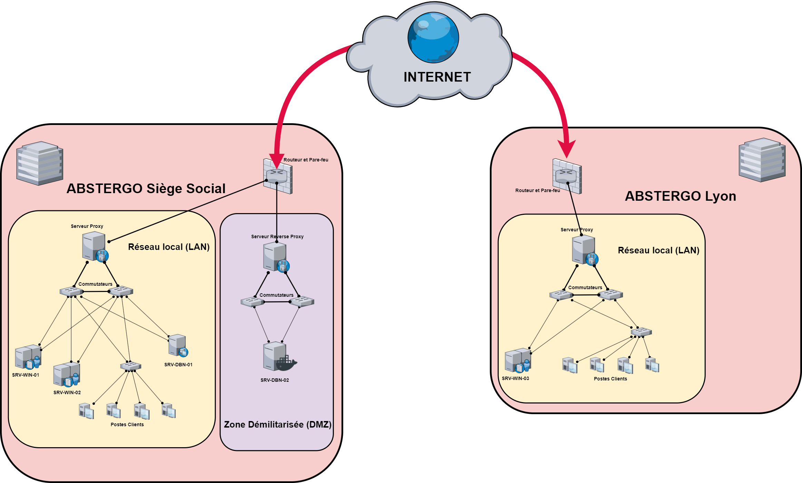
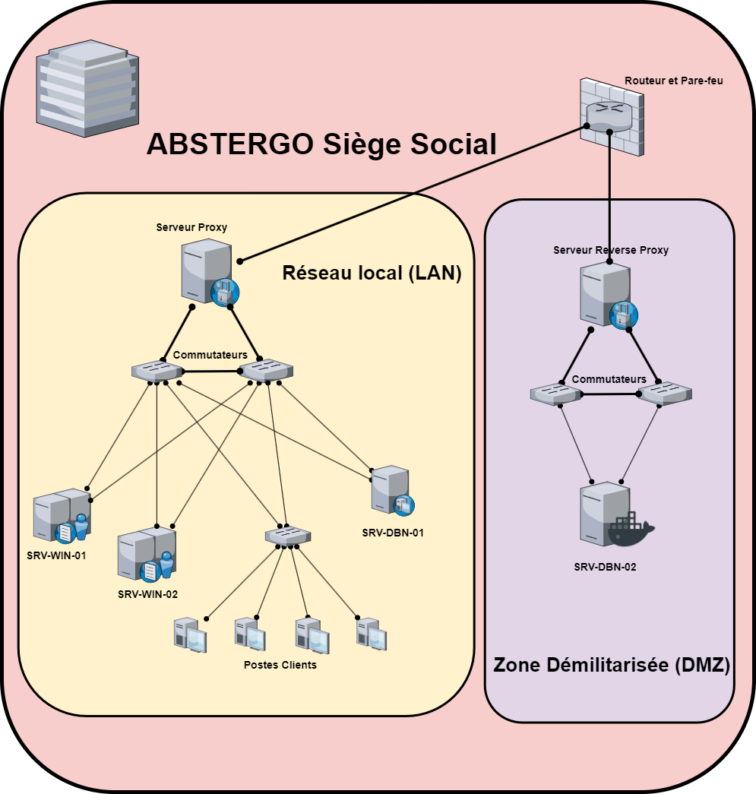
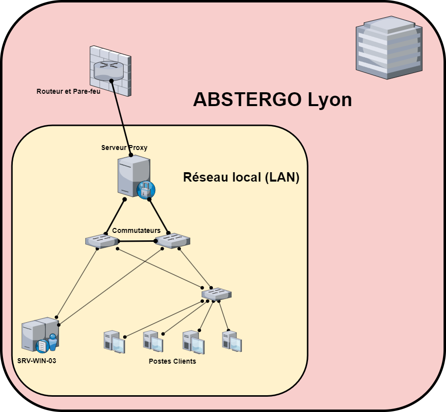

Documentation technique de l'infrastructure du Système d'Information
====================================================================

Bienvenu

# Sommaire
- [Coeur du Réseau](#coeur-du-réseau)
    - [Existant](#existant)
        - [Site du Siège Social](#site-du-siège-social)
            - [Plan d'adressage, réseau local (LAN)](#plan-dadressage-réseau-local-lan)
            - [Plan d'adressage, zone démilitarisée (DMZ)](#plan-dadressage-zone-démilitarisée-dmz)
        - [Site de Lyon](#site-de-lyon)
            - [Plan d'adressage, réseau local (LAN)](#plan-dadressage-rc3a9seau-local-lan-1)
            - [Plan d'adressage, zone démilitarisée (DMZ)](#plan-dadressage-zone-dc3a9militarisc3a9e-dmz-1)
    - [Politique de sécurité](#politique-de-sécurité)
        - [Pare-feu](#pare-feu)
        - [Translation d'Adresse](#translation-dadresse)
    - [Serveurs Mandataire](#serveurs-mandataire)
        - [Serveur Mandataire de Transmission, Proxy](#serveur-mandataire-de-transmission-proxy)
        - [Serveur Mandataire de Redirection,  Reverse Proxy](#serveur-mandataire-de-redirection-reverse-proxy)
    - [Tunneling VPN](#tunneling-vpn)
- [Orchestration des Services](#orchestration-des-services)
    - [Serveur de Supervision](#serveur-de-supervision)
        - [Ajout d'un hôte](#ajout-dun-hôte)
    - [Serveur de Conteneurisation](#serveur-de-conteneurisation)
        - [Plateforme de Conteneurisation](#plateforme-de-conteneurisation)
        - [Services Conteneurisés](#services-conteneurisés)
        - [Utilisation de Portainer](#utilisation-de-portainer)
    - [Serveur Active Directory](#serveur-de-conteneurisation)
    - [Serveur DNS](#serveur-de-conteneurisation)
    - [Administration](#administration)
        - [Management](#management)
            - [Scripts](#scripts)
        - [Productions de Rapports (Reporting)](#productions-de-rapports-reporting)
- [Prestataires et Services Externalisés](#prestataires-et-services-externalisés)
    - [Contrat d'infogérance et Plan de Reprise d'Activité (PRA) - NOWTEAMS](#contrat-dinfogérance-et-plan-de-reprise-dactivité-pra---nowteams)
    - [Contrat de maintenance et Système de Sauvegarde Externalisé - wandesk](#contrat-de-maintenance-et-système-de-sauvegarde-externalisé---wandesk)

🔎 *Cliquez sur les liens pour accéder directement à la section correspondante.* 🔎


# Coeur du Réseau
## Existant


| Nom du Réseau | Nombre d'hôtes souhaités | Nombre d'hôtes disponnibles | Nombre d'IP restantes | CIDR | Masque | Adresse Réseau | Plage utilisable | Addresse de diffusion | Paserelle |
|---------------|--------------------------|-----------------------------|-----------------------|------|--------|----------------|------------------|-----------------------|-----------|
| **Abstergo HQ - LAN**   | 89 | 253 | 164 | /24 | 255.255.255.0 | 192.168.25.0  | 192.168.25.1  - 192.168.25.253  | 192.168.25.255  | 192.168.25.1  |
| **Abstergo HQ - DMZ**   |  2 | 253 | 251 | /24 | 255.255.255.0 | 192.168.50.0  | 192.168.50.1  - 192.168.50.253  | 192.168.50.255  | 192.168.50.1  |
| **Abstergo Lyon - LAN** | 16 | 253 | 237 | /24 | 255.255.255.0 | 192.168.25.0  | 192.168.25.1  - 192.168.25.253  | 192.168.25.255  | 192.168.25.1  |
| **Abstergo Lyon - DMZ** |    | 253 | 253 | /24 | 255.255.255.0 | 192.168.100.0 | 192.168.100.1 - 192.168.100.253 | 192.168.100.255 | 192.168.100.1 |

## Site du Siège Social


### Plan d'adressage, réseau local (LAN)
| Libellé                    | Nom du service / équipement | Adresse IPv4 / masque | Interface / Port |
|----------------------------|-----------------------------|-----------------------|-----------------|
| **Matériels réseaux**      |                             |                       |                  |
|                            | Routeur, Pare-feu, Serveur Proxy | **🌐 85.51.94.49, adresse publique fournise par le FAI**      | em0 |
|                            | Routeur, Pare-feu, Serveur Proxy | 192.168.25.1 / 255.255.255.0                                  | em1 |
|                            | Routeur, Pare-feu, Serveur Proxy | 192.168.50.1 / 255.255.255.0                                  | em2 |
| **Serveurs**               |                             |                       |                  |
|                            | SRV-WIN-01                       | 192.168.25.2 / 255.255.255.0   | Ethernet0 |
|                            | SRV-WIN-02                       | 192.168.25.3 / 255.255.255.0   | Ethernet0 |
|                            | SRV-WIN-01                       | 192.168.25.2 / 255.255.255.0   | Ethernet0 |
|                            | SRV-DBN-01                       | 192.168.25.2 / 255.255.255.0   | ens33     |
| **Postes Clients**         |                             |                       |                  |
|                            | WIN-10-001                       | 192.168.25.129 / 255.255.255.0 | Ethernet0 |

### Plan d'adressage, zone démilitarisée (DMZ)
| Libellé                    | Nom du service / équipement | Adresse IPv4 / masque | Interface / Port |
|----------------------------|-----------------------------|-----------------------|-----------------|
| **Matériels réseaux**      |                             |                       |                  |
|                            | Routeur, Pare-feu, Serveur Proxy | **🌐 85.51.94.49, adresse publique fournise par le FAI**      | em0 |
|                            | Routeur, Pare-feu, Serveur Proxy | 192.168.25.1 / 255.255.255.0                                  | em1 |
|                            | Routeur, Pare-feu, Serveur Proxy | 192.168.50.1 / 255.255.255.0                                  | em2 |
| **Serveurs**               |                             |                       |                  |
|                            | SRV-DBN-02                       | 192.168.50.2 / 255.255.255.0   | ens33     |


## Site de Lyon


### Plan d'adressage, réseau local (LAN)
| Libellé                    | Nom du service / équipement | Adresse IPv4 / masque | Interface / Port |
|----------------------------|-----------------------------|-----------------------|-----------------|
| **Matériels réseaux**      |                             |                       |                  |
|                            | Routeur, Pare-feu, Serveur Proxy | **🌐 93.157.27.65, adresse publique fournise par le FAI**      | em0 |
|                            | Routeur, Pare-feu, Serveur Proxy | 192.168.75.1 / 255.255.255.0                                   | em1 |
|                            | Routeur, Pare-feu, Serveur Proxy | 192.168.100.1 / 255.255.255.0                                  | em2 |
| **Serveurs**               |                             |                       |                  |
|                            | SRV-WIN-03                       | 192.168.75.2 / 255.255.255.0   | Ethernet0 |
| **Postes Clients**         |                             |                       |                  |
|                            | WIN-10-002                       | 192.168.25.152 / 255.255.255.0 | Ethernet0 |

### Plan d'adressage, zone démilitarisée (DMZ)
| Libellé                    | Nom du service / équipement | Adresse IPv4 / masque | Interface / Port |
|----------------------------|-----------------------------|-----------------------|-----------------|
| **Matériels réseaux**      |                             |                       |                  |
|                            | Routeur, Pare-feu, Serveur Proxy | **🌐 93.157.27.65, adresse publique fournise par le FAI**      | em0 |
|                            | Routeur, Pare-feu, Serveur Proxy | 192.168.75.1 / 255.255.255.0                                   | em1 |
|                            | Routeur, Pare-feu, Serveur Proxy | 192.168.100.1 / 255.255.255.0                                  | em2 |

## Politique de sécurité

### Pare-feu
Cette section est dédiée à la configuration des pare-feu sur les routeurs. Dans le paysage informatique actuel, la sécurité est une priorité absolue. C'est dans cette optique qu'il a été convenu de déployer des pare-feu sur l'ensemble des routeurs présents sur chacun des sites de l'entreprise. Cette initiative vise à établir une "barrière" protégeant notre infrastructure contre les menaces potentielles.

Au cœur de la configuration des pare-feu se trouvent les Listes de Contrôle d'Accès (ACLs), des règles précises régissant le comportement du routeur en fonction du trafic entrant et sortant. Ces ACLs contribuent donc à maintenir un équilibre entre la connectivité nécessaire et la sécurité impérative.

L'environnement informatique étant dynamique, les règles de pare-feu peuvent évoluer en fonction des changements dans l'infrastructure ou de nouvelles politique de sécurité. Cette documentation reflète par conséquence la configuration actuelle, mais gardez à l'esprit que ces règles sont adaptables pour répondre aux nouveaux défis de sécurité tout en préservant une connectivité fluide. 


Les Listes de Contrôle d'Accès ci-dessous détaillent la politique de sécurité du pare-feu, déployée sur les différentes interfaces du réseau ABSTERGO. Chaque règle suit le format :
` [block/allow] [protocol/any] [source] [source port] [destination] [destination port] `


**⚠️ Important: Il est important de noter que les règles ACLs actuellement en place sur les pare-feu sont uniformes sur l'ensemble des routeurs déployés sur les différents sites d'ABSTERGO.**

#### _**Interface WAN**_
```
# Bloque les réseaux RFC 1918 (adresses IP privées)
block    any        any        *    10.0.0.0/8        *
block    any        any        *    172.16.0.0/12     *
block    any        any        *    192.168.0.0/16    *

# Bloque les plages d'adresses réservées non attribuées par l'IANA
block    any        any        *    100.64.0.0/10     *
block    any        any        *    169.254.0.0/16    *

allow    tcp        any        *    WAN.net           22 (SSH)
allow    tcp        LAN.net    *    any               *
allow    tcp        any        *    192.168.50.2      80 (HTTP)
allow    tcp        any        *    192.168.50.2      443 (HTTPS)
```

#### _**Interface LAN**_
```
# Anti-Lockout (par défaut)
allow    any        any        *    LAN.address       80 (HTTP)

allow    tcp        LAN.net    *    WAN.net           *
allow    tcp        LAN.net    *    DMZ.net           *
allow    tcp        LAN.net    *    any               80 (HTTP)
allow    tcp        LAN.net    *    any               443 (HTTPS)
allow    tcp/udp    any        *    any               53 (DNS)
allow    icmp/*     any        *    any               *

# Bloque tout le trafic entrant non autorisé
block    any        any        *    any               *
```

#### _**Interface DMZ**_
```
# Autorise tout le trafic en provenance de la LAN
allow    any        LAN.net    *    DMZ.net           *

allow    udp        DMZ.net    *    LAN.net           161 (SNMP)
allow    tcp        DMZ.net    *    LAN.net           389 (LDAP)
allow    tcp        DMZ.net    *    LAN.net           6556 (Agent CheckMK)

# Bloque tout le trafic non autorisé, en direction de la LAN 
block    any        DMZ.net    *    LAN.net           *
```


### Translation d'Adresse
Cette section se penche sur la modification des adresses IP lorsqu'elles traversent les pare-feu. Cette technique, également connue sous le nom de NAT (Network Address Translation), est utilisée pour mapper des adresses privées internes à des adresses publiques externes. 

Dans le contexte actuelle du Système d'Information, elle permet d'assurer un acheminement précis du trafic, facilitant l'accès aux services web tout en renforçant la sécurité globale de notre infrastructure.

Les redirections de port (*port forwarding* ou *port mapping*) ci-dessous détaillent la politique de sécurité du pare-feu:

| Interface | protocol | Source | Source Ports | Destination | Destination Ports | NAT IP | NAT Ports|
|---|---|---|---|---|---|---|---|
| WAN | tcp | any | * | WAN.address | 80 (HTTP)   | 192.168.50.2 | 80 (HTTP)  |
| WAN | tcp | any | * | WAN.address | 443 (HTTPS) | 192.168.50.2 | 443 (HTTPS)|


**⚠️ Important: Il est important de noter que les redirections de port ne sont présentes qu'au siège social de l'entreprise ABSTERGO, cela s'explique par la présence d'un Zone Démilitarisée sur ce site. [Pour plus d'information, veuillez vous référer à la section suivante, Site du Siège Social](#site-du-siège-social)**

## Serveurs Mandataire
Cette section se concentre sur les serveurs mandataires déployés au sein de l'infrastructure ABSTERGO, ces derniers permettent de complémenter les pare-feu et les ACLs compte tenu de la gestion du trafic réseau. Les serveurs mandataires, qu'ils agissent en tant que proxies ou en mode reverse proxy, permettent de contrôler et d'optimiser les communications entre les utilisateurs, les services et les ressources externes.

### Serveur Mandataire de Transmission, Proxy
Au sein de , des serveurs mandataires de transmission, communément appelés proxys, ont été déployés pour gérer et optimiser les communications réseau. Ces serveurs agissent en tant qu'intermédiaires entre les utilisateurs du réseau interne et les ressources externes sur Internet. Actuellement, ces proxys sont configurés pour faciliter l'accès aux services web depuis les postes de travail du siège social et du site de Lyon. Ils jouent un rôle essentiel dans le contrôle et la surveillance du trafic, renforçant ainsi la sécurité de notre réseau.

Au cœur du Système d'Information d'ABSTERGO, les serveurs mandataires de transmission, également connus sous le nom de proxys, sont déployés pour orchestrer et optimiser les échanges au sein du réseau. Ces serveurs jouent le rôle d'intermédiaires entre les utilisateurs internes et les ressources externes sur Internet, facilitant ainsi l'accès aux services web depuis les postes de travail du siège social et du site de Lyon. Ils contribuent activement à la gestion du trafic, renforçant la sécurité de notre réseau.

Ces serveurs mandataires de transmissions, sont déployés dans les réseaux locaux (LANs), et ces derniers sont gérés par Squid et SquidGuard. Ces proxys sont essentiels pour contrôler l'accès à Internet depuis les postes de travail locaux. Squid, en tant que serveur mandataire, assure le routage des requêtes web, tandis que SquidGuard permet la mise en place de listes noires pour filtrer l'accès à des sites web indésirables. Cette configuration renforce la sécurité des LAN en empêchant l'accès à des contenus inappropriés ou bien malveillants.

Les détails spécifiques de configuration, les règles de sécurité sont à retrouver à l'adresse suivante:
```
http://192.168.25.1             Site du Siège Social
http://192.168.75.1             Site de Lyon
```

**⚠️ Important : Ne vous étonnez pas de trouverez des configurations identiques sur les serveurs Proxy des différents sites, cela permet d'éviter des incohérences et assure une gestion uniforme des politiques de filtrage et de sécurité au niveau de l'ensemble de l'infrastructure ABSTERGO.**


### Serveur Mandataire de Redirection,  Reverse Proxy
Le Serveur Mandataire de Redirection, ou reverse proxy, déployé au sein de la [DMZ d'ABSTERGO](#site-du-siège-social) (présente au siège sociale), joue un rôle crucial dans la gestion du trafic réseau entrant. Géré par le logiciel Squid, ce serveur mandataire agit comme un intermédiaire entre les utilisateurs finaux et les serveurs Web internes. Sa principale fonction est de rediriger les requêtes externes vers les serveurs Web appropriés tout en offrant une couche de sécurité supplémentaire.

Le logiciel Squid, reconnu pour sa robustesse et ses fonctionnalités avancées, est utilisé pour administrer ce serveur mandataire de redirection. Sa configuration est soigneusement élaborée pour garantir un accès sécurisé aux ressources internes tout en offrant des fonctionnalités telles que la mise en cache des contenus et l'optimisation des performances.

La présence de ce reverse proxy dans la DMZ permet de ainsi protéger les serveurs Web internes des menaces potentielles provenant de l'Internet. Les détails spécifiques de configuration, les règles de sécurité sont à retrouver à l'adresse suivante:

```
http://192.168.50.1
```

**⚠️ Important: À l'heure actuelle, au sein d'ABSTERGO, un unique serveur reverse proxy à été déployé (dans la DMZ) et ce pour répondre aux besoins de l'architecture réseau. En revanche, il est important de noter que cette configuration est évolutive.**

## Tunneling VPN
Afin d'assurer une communication sécurisée et fiable entre le siège social et le site de Lyon, a été décidé la mise en place d'une solution de tunneling VPN (Vitrual Private Network). Permettant ainsi une connexion cryptée entre les deux sites, garantissant la confidentialité et l'intégrité des données échangées.

Le choix de cette solution a été motivé par plusieurs facteurs clefs. Tout d'abord, IPsec est reconnu comme un protocole de sécurité robuste, proposant des mécanismes de chiffrement solides et des méthodes d'authentification sécurisées. Permettant ainsi de garantir la confidentialité et l'intégrité des données transitant par le tunnel. De plus, sa large adoption en tant que standard ouvert favorise une interopérabilité étendue entre différents équipements réseau, offrant une flexibilité cruciale lors de l'intégration de nouveaux équipements ou de la mise à niveau de l'infrastructure. La flexibilité des options d'authentification, la gestion avancée des tunnels, et les performances optimisées pour un débit réseau élevé sont autant de caractéristiques qui ont influencé ce choix, assurant une connectivité constante, fiable et performante entre les deux sites.

### Scénarios d'utilisations
La mise en place du tunnel VPN entre le siège social et le site de Lyon vise à répondre à des besoins spécifiques, offrant une connectivité sécurisée et facilitant des scénarios d'utilisation essentiels. Les cas d'usage concrets du tunnel VPN comprennent :

- **Accès aux Services Centralisés:** Les utilisateurs du site de Lyon bénéficient d'un accès sécurisé aux services centralisés, hébergés exclusivement au siège social. Cette approche garantit une utilisation fluide de l'ERP et d'autres applications stratégiques.

- **Supervision à Distance:** Le tunnel VPN permet une supervision à distance du site de Lyon à partir du serveur de supervision localisé au siège social. Cette fonctionnalité assure une gestion proactive de la santé du réseau et des systèmes à Lyon.


### Configuration
```
Protocole VPN : IPsec
Phases de Négociation : Phase 1 et Phase 2

Phase 1 (Négotiation Principale)
    - Algorithme de Chiffrement : AES-256
    - Méthode de Hachage : SHA-256
    - Groupe DH (Diffie-Hellman) : Groupe 14 (2048 bits)
    - Durée de vie : 28800 secondes
    - DPD (Détection de Chute de Tunnels) :
        - Activation : Oui
        - Intervalle : 10 secondes
        - Essais avant l'échec : 5 essais


Phase 2 (Négotiation Principale)
    - Protocole : ESP 
    - Algorithme de Chiffrement : AES-256
    - Méthode de Hachage : SHA-256
    - Groupe de Clés PSF (Perfect Forward Secrecy) : Groupe 14 (2048 bits)
    - Durée de Vie : 3600 secondes
    - Keep Alive : Activé


Authentification
    - Méthode : Clé partagée
    - Clé partagée : 0ddda55d3a4af6f8a739a6f3483f9f2a4f8e69cf32aadaf4a3b41049
```

### Évolutivité et Modifications du Tunnel VPN
Cette section vise à mettre en lumière la capacité du tunnel VPN à évoluer en fonction des besoins changeants de l'entreprise et à intégrer des modifications sans compromettre la stabilité du système.

- **Redondance du Tunnel VPN:** Pour garantir une disponibilité continue des services, le tunnel VPN a été conçu avec une architecture redondante. En cas de défaillance d'un lien ou d'un équipement, un tunnel de secours (backup) entre le siège social et le site de Lyon s'active automatiquement. Cette redondance assure une connectivité ininterrompue, minimisant les temps d'indisponibilité potentiels.

- **Adaptabilité aux Évolutions:** L'architecture du tunnel VPN a été pensée pour s'adapter aux évolutions futures du système d'information. Les paramètres de configuration, tels que les algorithmes de chiffrement, les méthodes d'authentification, et les capacités de détection de chute de tunnel, peuvent être ajustés en fonction des meilleures pratiques de sécurité et des besoins opérationnels à venir.


# Orchestration des Services

## Serveur de Supervision
Dans le cadre de la refonte du Système d'Information présent à ABSTERGO, a été décidé le déploiement d'un serveur de supervision. Cette solution jugée essentielle permet de suivre en temps réel l'évolution du Système d'Information. Cette solution offre donc la possibilité de détecter rapidement les anomalies, de prévenit d'éventuelles pasnnes, et d'assurer la stabilité continue des services.

En tant que solution de supervision, notre choix s'est naturellement porté vers CheckMK. Ce logiciel se démarque par son niveau élevé d'automatisation, incluant la découverte automatique des services, la configuration intuitive via une interface graphique, et une gestion intégrée des agents, réduisant ainsi considérablement la charge de travail manuelle. De plus CheckMK offre une couverture exhaustive grâce à une vaste sélection de plugins de surveillance maintenus par les constructeurs.

**Le service CheckMK est accessible à l'adresse suivante**, vous y retrouverez l'ensemble des serveurs présents au sein du siège social mais également au sein du site basé à Lyon. Cela est rendu possible par le biais du tunnel VPN mis en place.

[Pour plus d'information, veuillez vous référer à la section suivante, Tunneling VPN](#tunneling-vpn)
```
https://srv-dbn-01.abstergo.internal/abstergo
```

#### _**Ajout d'un hôte**_
Pour simplifier le processus d'ajout d'hôtes à CheckMK, nous avons développé un script pratique. Ce dernier permet d'automatiser l'ajout d'un hôte en utilisant des paramètres tels que le nom du site et le nom d'hôte. Toutefois, n'oubliez pas que cette tâche peut également être effectuée facilement via l'interface graphique de CheckMK.

Voici le script d'exemple que vous pouvez utiliser :
```shell
(
cat <<EOT
#!/bin/bash

site=\$1; shift
hostname=\$1; shift

mk_file="/opt/omd/sites/\$site/etc/check_mk/conf.d/wato/hosts.mk"
wato_file="\$(dirname \$mk_file)/.wato"

# exit with code 1 if host exists
(
cat <<EOT
GET hosts
Columns: host_name
EOT
) | su - \$site -c "lq" \
  | grep -q \$hostname
if [[ \$? == 0 ]]; then
  echo "\$hostname already added"
  exit 1
fi

host \$hostname &> /dev/null
if [[ \$? != 0 ]]; then
  echo "\$hostname failed to resolve"
  exit 1
fi

# add host to base wato hosts.mk
cat <<EOT >> \$mk_file
all_hosts += [ "\$hostname|wato|/" + FOLDER_PATH + "/" ]
host_attributes.update({'\$hostname': {}})
EOT

# update num_hosts var for wato
current_num_hosts=\$( cat \$wato_file | sed -e "s/^.*'num_hosts': //" -e "s/,.*\$//")
new_num_hosts=\$(( \$current_num_hosts + 1 ))
sed -i \$wato_file -e "s/'num_hosts': [0-9]\+/'num_hosts': \$new_num_hosts/"

su - \$site -c "cmk -II \$hostname"

exit 0
EOT
) | bash -s SITENAME HOSTNAME
```


## Serveur de Conteneurisation
L'infrastructure du Système d'Information d'ABSTERGO, intègre un serveur spécifiquement dédié à la conteneurisation. Cette décision stratégique, découle de la volonté d'offrir une solution efficace pour encapsuler, distribuer et exécuter des applications de manière indépendante, permettant par la même occasion une maintenance ainsi qu'un déploiement accéléré.


Le choix de la conteneurisation plutôt que de la vritualisation repose sur plusieurs considérations clés, visant à optimiser l'efficacité ainsi que la gestion de l'infrastructure. Contrairement à la virtualisation, qui encapsule un système d'exploitation entier avec ses ressources, la conteneurisation isole uniquement l'application et ses dépendances, partageant le même noyau d'exploitation avec le système hôte.

De plus, la conteneurisation offre une grande flexibilité, permettant non seulement une utilisation plus efficiente des ressources système, des temps de démarrage plus rapides, mais également la possibilité de créer rapidement de nouveaux conteneurs pour répartir la charge en cas de besoin. Cette capacité dynamique à ajuster la capacité selon les exigences spécifiques de chaque service garantit une réponse agile aux variations de charge et une utilisation optimale des ressources disponibles


### Plateforme de Conteneurisation
Au sein de l'infrastructure du Système d'Information d'ABSTERGO, la technologie de conteneurisation Docker a été sélectionner en tant que plateforme principale. Il est agréable de noté que, Docker est reconnu pour sa facilité d'utilisation, sa portabilité ainsi que son écosystème riche de conteneurs prêts à l'emploi. Son architecture légère et efficace en faisait un choix idéal, offrant une gestion simplifiée des conteneurs tout en assurant une isolation robuste.

### Services Conteneurisés
Dans le cadre de la migration vers l'infrastructure actuelle, nous avons reconduit plusieurs services présent au sein de l'ancienne architecture. Parmis ces services nous recensons les suivants : 

- **Le système ERP (Enterprise Ressource Plannning), Dolibarr.**

    La conteneurisation de Dolibarr a été privilégiée pour moderniser la gestion des opérations métier. Une approche modulaire a été adoptée à l'aide de Docker Compose. **Toutefois, il est important de noter que la base de données MariaDB n'est pas stockée dans le conteneur Docker, mais dans un emplacement externe. Cette configuration a été délibérément choisie pour simplifier la gestion du conteneur, tout en préservant l'intégrité des données en cas de suppression ou de modification du conteneur.** Cette stratégie garantit une séparation claire entre l'application Dolibarr et ses données sous-jacentes, facilitant ainsi la sauvegarde, la restauration et la gestion globale du Progiciel de Gestion Intégré (PGI / ERP).

    De plus l'adoption de cette nouvelle architecture conteneurisée garantit un environnement isolé et adaptable. Les avantages englobent un déploiement rapide des services, une maintenance simplifiée et une gestion efficace des dépendances entre les composants. Cette orientation renforce la stabilité et la disponibilité de l'ERP tout en simplifiant les ajustements ou évolutions futures de l'infrastructure.

- **L'Autocommutateur téléphonique privé (PBX), Asterisk.**

    La conteneurisation d'Asterisk a été choisie afin de regrouper de manière centralisée plusieurs services connexes. Parallèlement, cette décision a permis l'intégration des services PrivateDial, WebSMS et AutoBan au sein du même conteneur. Comme précedement, cette approche modulaire, orchestrée par Docker Compose, offre le flexibilité nécessaire pour faire coexister et interagir intelligement l'ensemble de ces services au sein du même environement.

    **En revanche il convient de souligner que les données d'Asterisk, comprenant la configuration et les enregistrements, sont délibérément stockées à l'extérieur du conteneur Docker, dans un emplacement dédié. Cette approche, identique à celle choisie pour la conteneurisation de Dolibarr, a pour objectif de simplifier la gestion du conteneur tout en préservant l'intégrité des données en cas de modifications ou de suppression du conteneur.** La séparation distincte entre l'application Asterisk et ses données sous-jacentes facilite ainsi les opérations de sauvegarde, de restauration et de gestion globale du système de communication.

    Cette approche permet, ainsi le déploiement d'un solution modulaire, s'occupant des différents services associés aux systèmes de PBX IP et aux passerelles VoIP. Par ailleurs cette encapsulation permet l'ajout ou le retrait de service similaire, assurant une adaptabilité continue aux besoins évolutifs d'ABSTERGO.
    
### Utilisation de Portainer
Pour simplifier la gestion et favoriser l'intégration harmonieuse des conteneurs actuels et futurs, nous avons opté pour Portainer. Portainer est une interface utilisateur centralisée, largement populaire, qui offre une visualisation claires des conteneurs, images, volumes et réseaux. En complément de Docker, Portainer permet une prise en main facilitée des ressources Docker sur le serveur, évitant ainsi la nécessité d'utiliser des commandes complexes.

Cette combinaison simplifie l'administration des applications et services conteneurisés, facilitant la surveillance, la gestion et l'ajustement des ressources en fonction des besoins spécifiques.

**Le conteneur Portainer est accessible à l'adresse suivante**
```
https://srv-dbn-02.abstergo.internal:9443       <--(Attention à ne pas omettre le port)
```

## Serveur Active Directory

## Serveur DNS


## Administration
### Management
#### Scripts

### Productions de Rapports (Reporting)


# Prestataires et Services Externalisés
## Contrat d'infogérance et Plan de Reprise d'Activité (PRA) - NOWTEAMS
Actuellement, ABSTERGO explore de nouvelles opportunités pour renforcer davantage la robustesse de son infrastructure. Dans cette optique, nous sommes en phase de négociation avec l'entreprise **NOWTEAMS** en vue de la mise en place d'un contrat d'infogérance complet. Ce partenariat potentiel permettrait d'optimiser la gestion quotidienne de nos systèmes informatiques, offrant une expertise spécialisée et des services adaptés aux besoins spécifiques du Système d'Information.

Parallèlement, nous envisageons sérieusement la mise en œuvre d'un Plan de Reprise d'Activité (PRA) en collaboration avec **NOWTEAMS**. Un tel plan vise à assurer la continuité de nos opérations en cas d'incident majeur, en définissant des procédures efficaces pour la restauration rapide de nos services essentiels.

Un devis est actuellement en cours de finalisation, et nous sommes confiants que ce partenariat potentiel contribuera à renforcer la résilience et la performance de notre infrastructure.

[Pour plus d'information, veuillez vous rendre sur le site internet de **NOWTEAMS**](https://www.nowteam.net/)


## Contrat de maintenance et Système de Sauvegarde Externalisé - wandesk
Dans le cadre de notre engagement envers la stabilité et la disponibilité de l'infrastructure du Système d'Information, a été établit la souscription à un contrat de maintenance et d'infogérance assuré par **wandesk**. Ce contrat permet de bénéficier faire bénéficier à ABSTERGO, d'un support professionnel dédié, assurant la gestion proactive de ses systèmes, la résolution rapide des incidents, ainsi que la mise en place de mises à jour et de correctifs essentiels.

Parallèlement, afin de garantir la sécurité des données et d'assurer une reprise d'activité efficace en cas d'incident, nous avons opté pour une solution de sauvegarde externalisée vers le cloud, assurée par également par **wandesk**. Cette approche offre, tranquillité d'esprit en assurant la sauvegarde régulière des données sensibles dans un environnement distant, conforme aux normes de sécurité les plus strictes.


[Pour plus d'information, veuillez vous référer au contrat établit précedement avec **wandesk** avec leur service **Cloud4Me**](../vendors/devis_cloud&contrat_de_maintenace_Cloud4Me.pdf)

###### Auteur : *Titouan BAZIN*.
